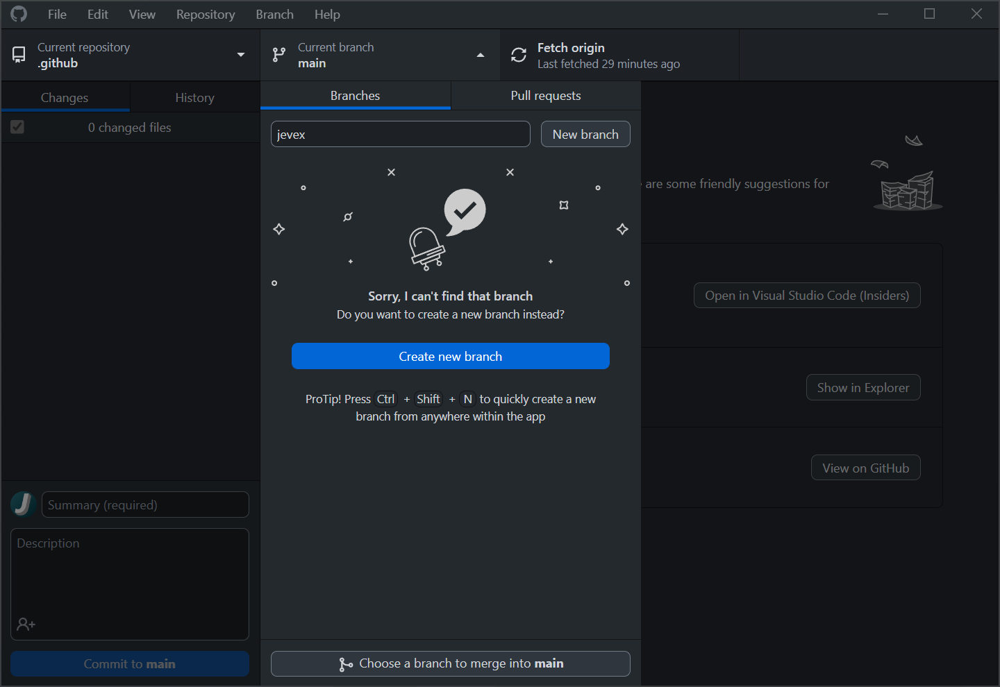

# GitHub Tutorial
Welcome to the CTMC's GitHub Tutorial repository. This guide will walk you through the process of contributing to CTMC projects hosted on GitHub.

This tutorial has been designed with Windows users in mind so some steps may not reflect what you will need to do if using MacOS or Linux. In this case, feel free to reach out to [Jevex](https://github.com/jevexendo) on Discord at `Jevex#3001` for guidance if you require additional assistance.

Additionally, during some parts of this tutorial you may read some terminology that you are unfamiliar with. No need to worry, you do not need to understand terms like "branch protection" to follow this tutorial, those details are simply provided in the event you would like to learn more about the topics that this tutorial covers.

# Joining the Team
To get started contributing to community repositories, you will need to have a GitHub account which you can sign up for here: https://github.com/signup.

You will need to enable 2FA on your account as it is required for all members of the [ctm-community](https://github.com/ctm-community) organization and will be required for all GitHub users by the end of 2023.

Once you have an account, contact [Jevex](https://github.com/jevexendo) on Discord at `Jevex#3001` to get added to the [mapmakers](https://github.com/orgs/ctm-community/teams/mapmakers) team. This will give you permission to [push](https://github.com/git-guides/git-push) code to unprotected branches on the current community project.

# Git and GitHub Desktop
In addition to a GitHub account, you will need to have either [Git for Windows](https://gitforwindows.org/) or [GitHub Desktop](https://desktop.github.com/) installed on your computer.

On Windows, this can be done using the [Windows Package Manager CLI](https://winget.run/) (winget) by running the following commands in a terminal (e.g. Windows Terminal, PowerShell, Command Prompt):

Install Git for Windows:
```
winget install -e --id Git.Git
```

Install GitHub Desktop:
```
winget install -e --id GitHub.GitHubDesktop
```

After installing GitHub Desktop you will be welcomed by this screen upon launching it for the first time:


Select the `Sign in to GitHub.com` option to link your account and after following the prompts in your web browser, you will be asked to `Configure Git` with a window similar to this one:


The default settings should work just fine so you can proceed to the next step after clicking `Finish`.

# Cloning a Repository
Once you have been added to the `mapmakers` team, you will need to clone the repository by following the instructions below for GitHub Desktop or checking out GitHub's tutorial: https://github.com/git-guides/git-clone.

If you have linked your GitHub account to GitHub Desktop, then you can clone a repository by going into the `File` menu and selecting `Clone repository...` or using the keyboard shortcut `Ctrl+Shift+O` on Windows.

This will bring up the `Clone a Repository` window where you can select the repository you would like to clone. If you are a member of the `ctm-community` organization, you should be able to filter the list for the repository you would like to clone. However, if you are still waiting to get added, you can also clone the repository in the `URL` tab by directly pasting in the repository's URL.


# Creating a Branch
When you first clone a repository, you will be on the repository's `main` branch. Since this branch is the official branch, it is protected and you will not be allowed to modify it directly. Instead, you will need to create a feature branch to make your changes and you can do this by selecting the `Current branch` dropdown menu, typing in your username, and selecting `Create a new branch`:



Although the branch name could technically be anything, it is recommended to use your username as the name of your branch to make it easier to keep track of contributions and locate the branch of specific contributors.
